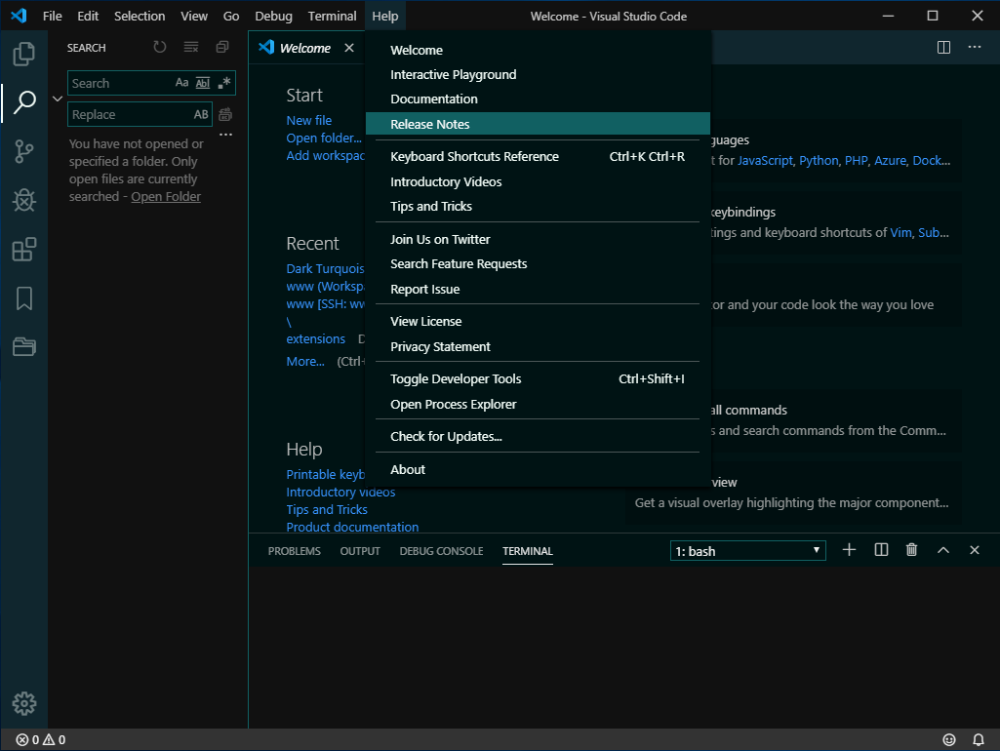
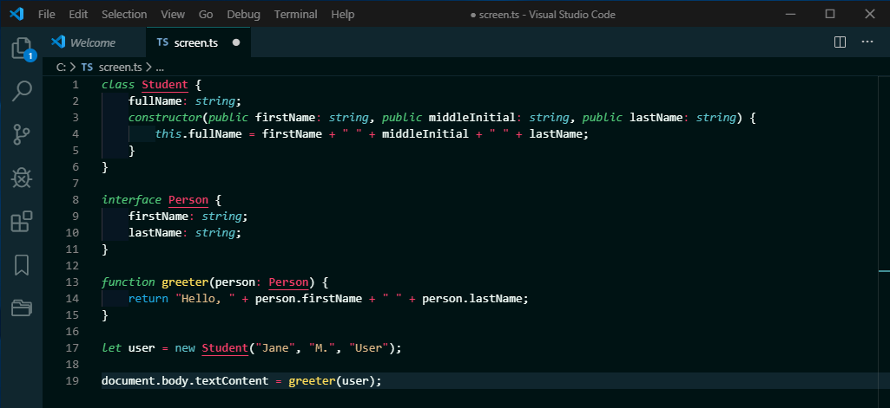
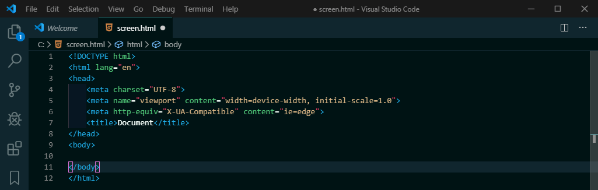

# Dark Turquoise

[](https://marketplace.visualstudio.com/items?itemName=999-Victor.dark-turquoise)
[](https://marketplace.visualstudio.com/items?itemName=999-Victor.dark-turquoise)
[](https://marketplace.visualstudio.com/items?itemName=999-Victor.dark-turquoise)

A Visual Studio Code theme based on turquoise shades. Calm color scheme helps you focus on all code points without straining.
Match brackets have purple border to have your attention.  
I hope you'll enjoy it! 💥

## Workspace



### TypeScript Example



### HTML Example



## Installation

1. Install [Visual Studio Code](https://code.visualstudio.com/)
2. Launch Visual Studio Code
3. Choose **Extensions** from activity bar _(cmd+shift+X)_
4. Search for `dark turquoise`
5. Click **Install** to install it
6. Click: Manage > **Color Theme** _(cmd+K+T)_
7. Choose **Dark Turquoise**

## Configuration

You may change the color of bracket match borders (_default it's purple_), follow the steps:

1. Open User Settings _(cmd+,)_
2. Search settings.json
3. Edit settings.json
4. add `"editorBracketMatch.border": "#c0c0c0",` (_you may choose any color_)

### Other extensios at the preview

The indentation colorized by [indent-rainbow](https://marketplace.visualstudio.com/items?itemName=oderwat.indent-rainbow) whith these user settings

```json
"indentRainbow.colors": [
    "rgba(104,56,210,0.07)",
    "rgba(65,136,210,0.07)",
    "rgba(13,88,166,0.07)",
    "rgba(4,55,108,0.07)",
],
```

You can also see the icons of these expressions:

* [Bookmarks](https://marketplace.visualstudio.com/items?itemName=alefragnani.Bookmarks)
* [Project Manager](https://marketplace.visualstudio.com/items?itemName=alefragnani.project-manager)
* [VSCode simpler Icons with Angular](https://marketplace.visualstudio.com/items?itemName=davidbabel.vscode-simpler-icons)

### Explanation

**cmd** is **ctrl** in Windows.

### Communication

Please leave a review ⭐[here](https://marketplace.visualstudio.com/items?itemName=999-Victor.dark-turquoise&ssr=false#review-details)⭐  
Questions and suggestions: [Github Issues](https://github.com/999-Victor/vscode-dark-turquoise-theme/issues)
