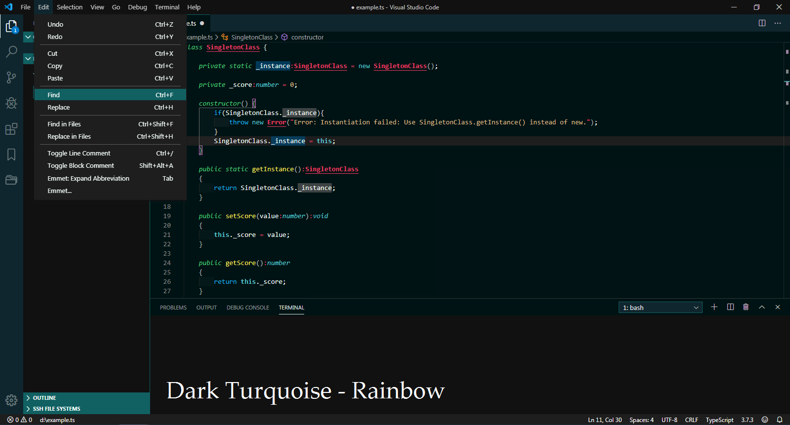
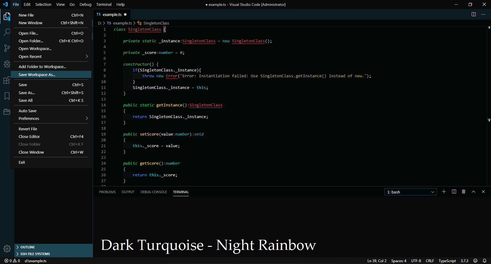

# Dark Turquoise

[](https://marketplace.visualstudio.com/items?itemName=999-Victor.dark-turquoise)
[](https://marketplace.visualstudio.com/items?itemName=999-Victor.dark-turquoise&ssr=false#review-details)
[](https://github.com/999-Victor/VSCode-Dark-Turquoise)  
[](https://marketplace.visualstudio.com/items?itemName=999-Victor.dark-turquoise)
[](https://marketplace.visualstudio.com/items?itemName=999-Victor.dark-turquoise)
[](https://github.com/999-Victor/VSCode-Dark-Turquoise/issues)  

A turquoise-based theme package for [Visual Studio Code](https://code.visualstudio.com/).
>*A calm colors helps you don't strain.*  
*Different color schemes created for different brightness.*  
*Borders of matched bracket pair are highlighted in purple for your attention (configurable).*  

**[Vote please](https://marketplace.visualstudio.com/items?itemName=999-Victor.dark-turquoise&ssr=false#review-details)**

***

## Themes

### Dark Turquoise ~ Rainbow

This theme has **rainbow** color palette and this theme colors make this theme better for **low brightness** displays.


### Dark Turquoise ~ Night Rainbow

This theme has **rainbow** color palette and this theme colors make this theme better for **high brightness** displays.


## Installation

Install the theme from [here](https://marketplace.visualstudio.com/items?itemName=999-Victor.dark-turquoise) or follow the steps:

1. Launch [Code](https://code.visualstudio.com/).
2. Choose Extensions from the activity bar or serch command `Intall Extentions` or press `cmd+shift+X`.
3. Search for **dark turquoise**.
4. Install extention **Dark Turquoise**.
5. Choose `Preferenses: Color Theme` or press `cmd+K+T`
6. Select any **Dark Turquoise** theme and enjoy it!

**cmd** is **ctrl** in Windows.

## Configuration

You may change the color of brackes match border (*default it's purple*), to do this follow the steps:

1. Open User Settings (press `cmd+,` / `ctrl+,`)
2. Search *settings.json*
3. Edit *settings.json*
4. add `"editorBracketMatch.border": "#dcdcdc"` (*you may choose any color*)

### Preferences at the preview

I recommend the [indent-rainbow](https://marketplace.visualstudio.com/items?itemName=oderwat.indent-rainbow) extension with these user settings

```json
"indentRainbow.colors": [
    "rgba(255,255,255,0.00)",
    "rgba(255,255,255,0.02)",
    "rgba(255,255,255,0.04)",
    "rgba(255,255,255,0.02)",
],
```

All brackets are colorized to gray by [Bracket Pair Colorizer 2](https://marketplace.visualstudio.com/items?itemName=CoenraadS.bracket-pair-colorizer-2)

```json
"bracket-pair-colorizer-2.colors": [
    "#d3d3d3",
    "#c0c0c0",
    "#a9a9a9"
],
```

also this extension adds nice current section lines.

***

[Release Notes](CHANGELOG.md)  
[Issues](https://github.com/999-Victor/vscode-dark-turquoise-theme/issues)

***

[](https://paypal.me/999Victor)  
