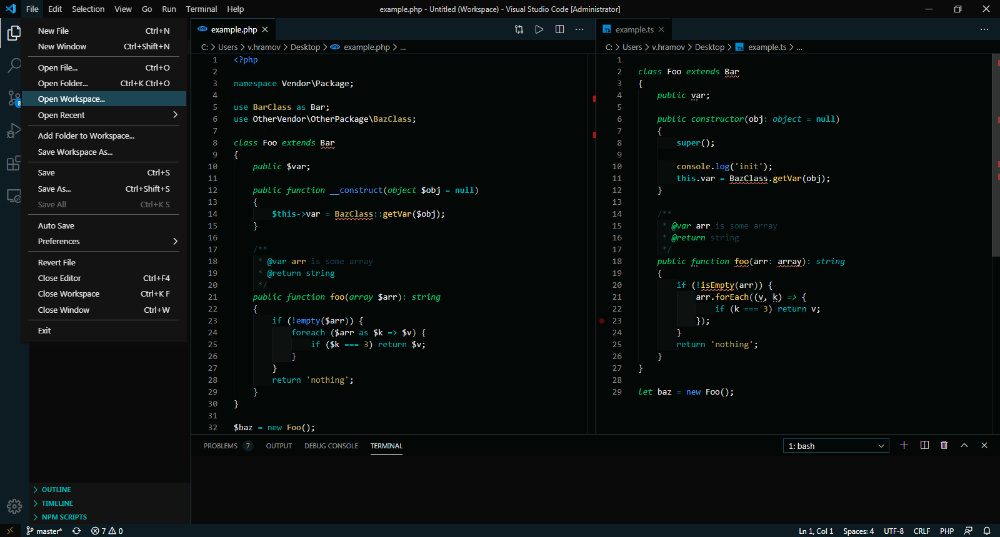
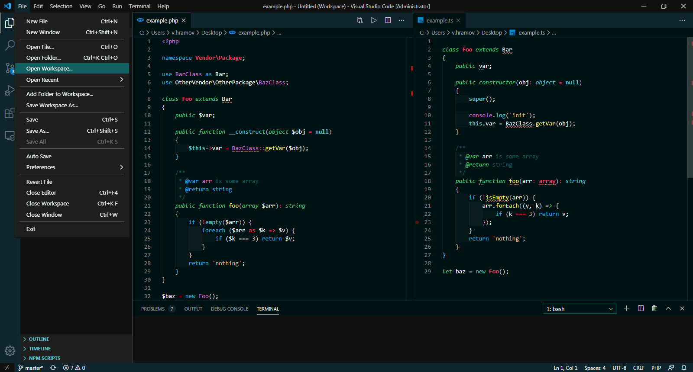
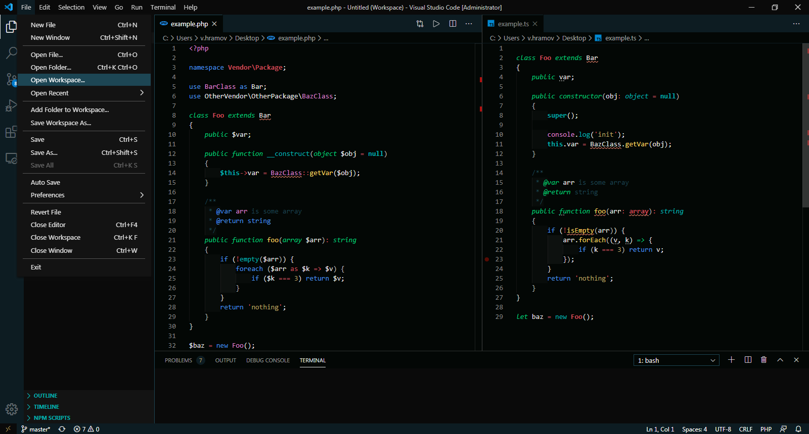

# Dark Turquoise

[](https://marketplace.visualstudio.com/items?itemName=999-Victor.dark-turquoise)
[](https://marketplace.visualstudio.com/items?itemName=999-Victor.dark-turquoise)
[](https://marketplace.visualstudio.com/items?itemName=999-Victor.dark-turquoise&ssr=false#review-details)  

***

A turquoise-based theme package for [Visual Studio Code](https://code.visualstudio.com/).  
  
**Night** themes for the high brightness displays.  
**Rainbow** themes has rich color palette.  

***

## Preview

* **Dark Turquoise**

* **Dark Turquoise ~ Night**

* **Dark Turquoise ~ Rainbow**

* **Dark Turquoise ~ Night Rainbow**


## Installation

Install the theme from [here](https://marketplace.visualstudio.com/items?itemName=999-Victor.dark-turquoise) or follow the steps:

1. Launch [Code](https://code.visualstudio.com/).
2. Choose Extensions from the activity bar or serch command `Intall Extentions` or press `cmd+shift+X`.
3. Search for `dark turquoise`.
4. Install extention `Dark Turquoise`.
5. Choose `Preferenses: Color Theme` or press `cmd+K+T`
6. Select any `Dark Turquoise` theme and enjoy it!

`cmd` is `ctrl` in Windows.

## Configuration

To change the color of brackes match border (*purple by default*), add to settings.json:

```json
"workbench.colorCustomizations": {
    "[Dark Turquoise ~ THEME]": {
        "editorBracketMatch.border": "#a9a9a9"
    }
},
```

If you want more, open an issue and tell me what you'd like to change

## Best practices

### Icons

Try **[material icons](https://marketplace.visualstudio.com/items?itemName=PKief.material-icon-theme)** with **turquoise folders!**  

Add this to your settings  
`"material-icon-theme.folders.color": "#5ec4cd",`  
  
If you use a night theme, the color is `#00b3b3`

### UI helpers

I recommend the **[indent-rainbow](https://marketplace.visualstudio.com/items?itemName=oderwat.indent-rainbow)** extension with these user settings

```json
"indentRainbow.colors": [
    "rgba(255,255,255,0.00)",
    "rgba(255,255,255,0.02)",
    "rgba(255,255,255,0.04)",
    "rgba(255,255,255,0.02)",
],
```
  
Color editor's brackets in shades of grey by **[Bracket Pair Colorizer 2](https://marketplace.visualstudio.com/items?itemName=CoenraadS.bracket-pair-colorizer-2)**

```json
"bracket-pair-colorizer-2.colors": [
    "#d3d3d3",
    "#c0c0c0",
    "#a9a9a9"
],
```

Colorizer also adds nice current section lines!

***

* [Release Notes](CHANGELOG.md)  
* [Issues](https://github.com/999-Victor/vscode-dark-turquoise-theme/issues)
